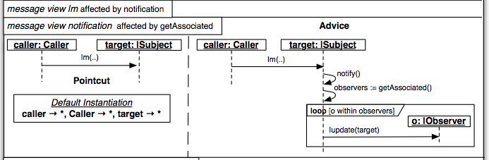

#Propuesta para la definición de la sintaxis concreta textual de la vista de mensajes de TextRam

##Vista de mensajes (diagramas de secuencia)

A continuación se presentan dos ejemplos de vistas de mensajes, que serviran como propuesta de la sintaxis concreta textual de TextRam

La Figura 1, visualize la vista de mensajes del aspecto *ZeroToManyAssociation*

Figura 1

`

       message initializeInstatiation {
	     pointcut {
		   caller:Caller -> new:|Data [new := create(..)]
         }

         advice {
		   caller:Caller -> new:|Data              [new := create()]
		   new:|Data     -> mySet:Set<|Associated> [mySet := create()]
         }

         instatiation {
		   caller -> *,
		   Caller -> *,
		   new    -> *
         }
       }

       message |Data.add {
	     pointcut {
		   caller:Caller -> target:|Data [add(|Associated a)]
         }
		 advice {
		   caller:Caller -> target:|Data           [add(|Associated a)]
		   Target:|Data  -> Myset:Set<|Associated> [insert(a)]
         }

         instantiation {
		   caller -> *,
		   Caller -> *,
		   new    -> *
         }
       }

       message |Data.remove {
	     pointcut {
		   caller : Caller -> target:|Data [remove(|Associated a)]
         }

         advice {
		   caller:Caller -> target:|Data           [remove<|Associated a>]
		   target:|Data  -> mySet:Set<|Associated> [remove(a)]
         }

         Instantiation {
		   caller -> *,
		   Caller -> *,
		   target -> *
         }
       }

       message cleanUp {
         pointcut {
		   caller:Caller -> target:|Data [delete(..)]
         }

         advice {
		   caller:Caller          -> target:|Data       [delete(..)]
		   mySet:Set<|Associated> -> mySet<|Associated> [delete()]
         }
       }

`

La Figura 2, muestra la vista de mensajes del aspecto *Observer*, lo destacable de este ejemplo es la visualización de la representación de un *loop*.

Figura 2

`

       message notification affectedBy getAssociated {
         pointcut {
           caller:Caller -> target:|Subject [|m(..)]
		 }

         advice {
		   caller:Caller   -> target:|Subject [|m(..)]
		   target:|Subject -> target:|Subject [notify()]
		   target:|Subject -> target:|Subject [observers := getAssociated]
		   for (o : observers) {
             target:|Subject -> o:|Observer [|update(target)]
           }
         }

         instantiation {
           caller -> *,
		   Caller -> *,
		   target -> *
         }
       }
	   

`
