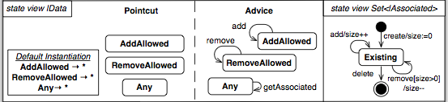

# Propuesta de la sintaxis concreta textual para TextRAM

##Vista de estados

###Ejemplo de vista de estados para el aspecto ZeroToManyAssociation

Figura 1 (Vista del estado |Data extraído del aspecto ZeroToManyAssociation)

Todas las propuestas que aparecen a continuación, están basadas en la Figura 1.

Propuesta 1 (basado en [Umple](http://cruise.eecs.uottawa.ca/umple/StateMachineActionsandDoActivities.html))

    stateView |Data {
      pointcut {
        state AddAllowed
        state RemoveAllowed
        state Any

        //instantion vs binding?
        instantiation {
          AddAllowed -> *
          RemoveAllowed -> *
          Any -> *
        }
      }

      advice {
	    state AddAllowed { add -> AddAllowed }
		state RemoveAllowed { remove -> RemoveAllowed }
		state Any { getAssociated -> Any }
      }
    }

    stateView Set<|Associated> {
	    state [*] { create/size:=0 -> Existing  }
		state Existing {
		                 add/size++ -> Existing
						 create/size:= 0 -> Existing
						 delete -> [*]
		}
    }

Propuesta 2 (basado en [PlantUML](http://plantuml.sourceforge.net/state.html))

    state |Data {
      pointcut {
        AddAllowed,
        RemoveAllowed,
        Any
      }
        //instantion vs binding?
      instantiation {
          AddAllowed -> *
          RemoveAllowed -> *
          Any -> *
        }
      }

      advice {
	    AddAllowed -> AddAllowed : add
		RemoveAllowed -> RemoveAllowed : remove
		Any -> Any : getAssociated
      }
    }

    state Set<|Associated> {
	  [*] -> Existing : create/size:=0
	  Existing -> Existing : add/size++
	  Existing -> Existing : remove[size>0]/size--
	  Existing -> [*] : delete			
    }
