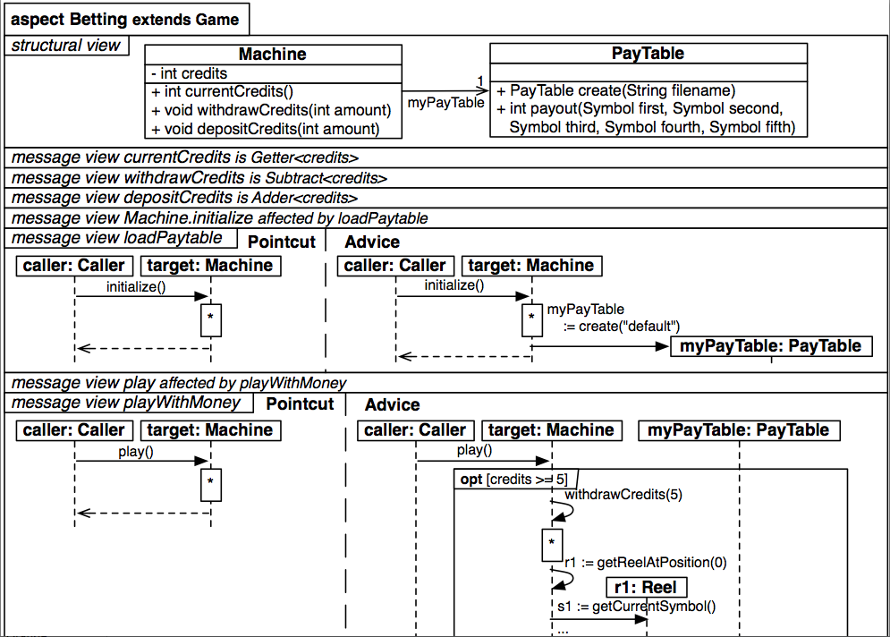

#Aspecto Betting

`

        aspect Betting extends Game {
		  structure {
		    class Machine {
              -int credits
			  +withDrawCredits(int amount)
			  +depositCredits (int amount)
            }

            class PayTable {
			  +PayTable create(String fileName)
			  +int payout     (Symbol first, Symbol second, Symbol third, Symbol fourth, Symbol fifth)
            }

            associations {
			  Machine --> 1 myPayTable
            }
          }

          messageView {
            message currentCredits  is Getter<credits>
    	    message withDrawCredits is Substract<credits>
	  	    message depositCredits  is Adder<credits>

            message Machine.initialize affectedBy loadPaytable
            message loadPaytable {
		      pointcut {
			    caller:Caller  -> target:Machine      { initialize() }
              }

              advice {
			    caller:Caller  -> target:Machine      { initialize() }
			    target:Machine -> myPayTable:PayTable { myPayTable := create("default") }
              }
            }

            message play affectedBy playWithMoney
		    message playWithMoney {
		      pointcut {
			    caller:Caller -> target:Machine       { play() }
              }

              advice {
			    caller:Caller  -> target:Machine      { play() }
			    target:Machine -> myPayTable:PayTable {  opt [credits >= 5] {
			                                               target:Machine -> target:Machine { withDrawCredits(5) }
				  										   target:Machine -> target:Machine { geetReelAtPosition(0) }
														   target:Machine -> r1:Reel        { getCurrentSymbol() }
														   target:Machine -> target:Machine { win := payout(s1, s2, s3, s4) }
														   target:Machine -> target:Machine { addCredits(win) }
                                                         }
			    }
              }
            }
		  }
        }

`
