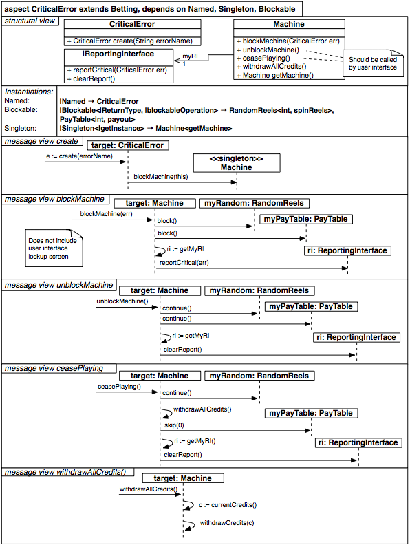

#Aspecto CriticalError

El aspecto CriticalError tiene 3 particularidades:

1. Instanciación de Blockable en la vista estrucural:

`

          Blockable { |Blockable<|ReturnType, |blockableOperation> -> RandomReels<int, spinReels>, PayTable<int,payout> }

`

La instanciación de Blockable<|ReturnType,|blockableOperation> se realiza con dos clases separadas por comas  *RandomReels<int, spinReels>, PayTAble<int, payout>*

2. Estereotipo en la clase Machine en el mensaje create: *<<Singleton>>*

3. Mensaje sin clase origen en la vista de mensajes *create*; para la representación del origen se utilizó *>>* (el mismo símbolo utilizado la vista de estados para representar el inicio de un diagrama)

`

            messageView {
			  message create {
                >>                    -> target: CriticalError { e := create(errorName }
                target: CriticalError -> <<singleton>>>Machine { blockMachine(this) }
				

              }
			...

`

`

          aspect CriticalError extends Betting, dependsOn Named, Singleton, Blockable {
		    structure {
			  class CriticalError {
			    +CriticalError create(String errorName)
              }

              class Machine {
                +blockMachine(CriticalError err)
                /**
			    * Should be called by user interface
			    */
			    +unblockMachine()

                /**
			    * Should be called by user interface
			    */
                +ceasePaying()
               
                +withDrawAllCredits()
			    +Machine getMachine()
              }

              class |ReportingInterface {
			    +reportCritical(CriticalError err)
			    +clearReport()
              }

              associations {
			    Machine --> 1 |ReportingInterface myRI
			  }

              instantiations {
			    Named     { |Named                  -> CriticalError }
			    Singleton { |Singleton<getInstance> -> Machine<getMachine>  }
			    Blockable { |Blockable<|ReturnType, |blockableOperation> -> RandomReels<int, spinReels> }
              }
            }

            messageView {
			  message create {
                >>                    -> target: CriticalError { e := create(errorName }
                target: CriticalError -> <<singleton>>>Machine { blockMachine(this) }
              }

              /**
			  * Does not include user interface lockup screen
			  */
              message blockMachine {
			    >>             -> target:CriticalError             { blockMachine(err) }
				target:Machine -> myRandom:RandomReels            { block() }
				target:Machine -> myPayTable:PayTable:RandomReels { block() }
				target:Machine -> target:Machine                   { ri := getMyRI() }
				target:Machine -> ri:ReportingInterface            {reportCritical(err) }
              }

              message unBlockMachine {
			    >>             -> target:Machine        { unblockMachine() }
				target:Machine -> myRandom:RandomReels  { continue() }
				target:Machine -> myPayTable:PayTable   { continue() }
				target:Machine -> target:Machine        { ri := getMyRI() }
				target:Machine -> ri:ReportingInterface { clearReport() }
              }

              message ceasePlaying {
			    >>             -> target:Machine        { ceasePlaying() }
				target:Machine -> myRandom:RandomReels  { continue() }
				target:Machine -> target:Machine        { withDrawAllCredits() }
				target:Machine -> target:Machine        { ri := getMyRI() }
				target:Machine -> ri:ReportingInterface { clearReport() }
              }

              message withDrawAllCredits {
			    >> -> target:Machine { withDrawAllCredits() }
			    target:Machine -> target:Machine { c:= currentCredits() }
			    target:Machine -> target:Machine { withDrawAllCredits(c) }
              }
            }
         }

         

`
