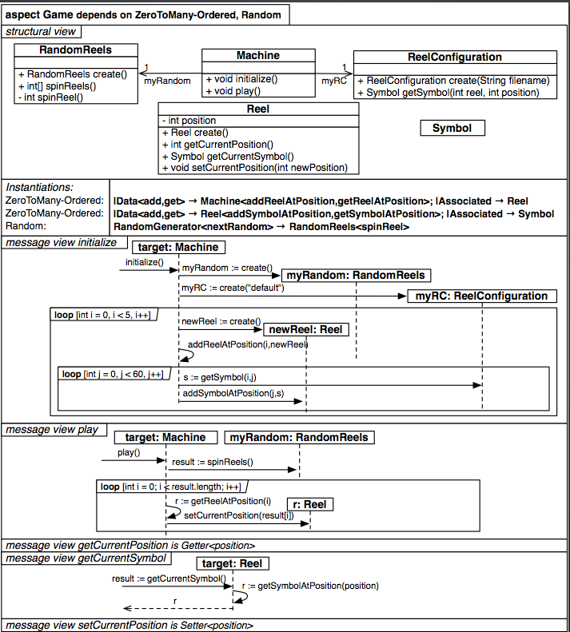

#Aspecto Game

`

          aspect Game dependsOn ZeroToMany-Ordered, Random {
		    structure {
			  class RandomReels {
			    +RandomReals create()
				+int[]       spinReels()
				-int         spinReels()
			  }
			  
			  class Machine {
			    +void initialize()
				+void play()
			  }
			  
			  class ReelConfiguration {
			    +ReelConfiguration create(String fileName)
				+Symbol getSymbol(int reel, int position)
			  }
			  
			  class Reel {
			    -int    position
				+Reel   create()
				+int    getCurrentPosition()
				+Symbol getCurrentSymbol()
				+void   setCurrenPosition(int newPosition)
			  }
			  
			  class Symbol {}
			  
			  instantiations {
			    ZeroToMany-Ordered {
				 |Data<add,get> -> Machine<addReelAtPosition,getReelAtPosition>;
				 |Associated    -> Reel
				 |Data<add,get> -> Reel<addSymbolAtPosition,getSymbolAtPosition>;
				 |Associated    -> Symbol
				}
				
				Random {
				  RandomGenerator<nextRandom> -> RandomReels<spinReel>
				}
			  }
			}
			
			messageView {
			  message initialize {
                >>             -> target:Machine             { initialize() }
               target:Machine -> myRandom:RandomReels       { myRandom := create() }
			    target:Machine -> myRC:ReelConfiguration     { myRC := create("default") }
				loop [ int i = 0, i < 5, i++ ] {
				  target:Machine -> newReel:Reel             { newReel := create() }
				  target:Machine -> target:Machine           { addReelAtPosition(i,newReel) }
				  
				  loop [ int j = 0, j < 60, j++ ] {
				    target:Machine -> myRC:ReelConfiguration { s := getSymbol(i,j) }
					target:Machine -> newReel:Reel           { addSymbolAtPosition(j,s) }
				  }
				} 
			  }
			  
			  message play {
			    >>             -> target:Machine       { play() }
			    target:Machine -> myRandom:RandomReels { result := spinReels() }

                loop [ int i = 0; i < result.length; i++ ] {
				  target:Machine -> target:Machine { r := getReelAtPosition(i) }
				  target:Machine -> r:Reel         { setCurrentPosition(result[i]) }
				}
			  }
			  
			  message getCurrentPosition is Getter<position>
			  message getCurrentSymbol {
			    >>          -> target:Reel { result := getCurrentSymbol() }
				target:Reel -> target:Reel { r := getSymbolAtPosition(position) }
			  }
			  
			  message setCurrentPosition is Setter<position>
			}
		  }

`
