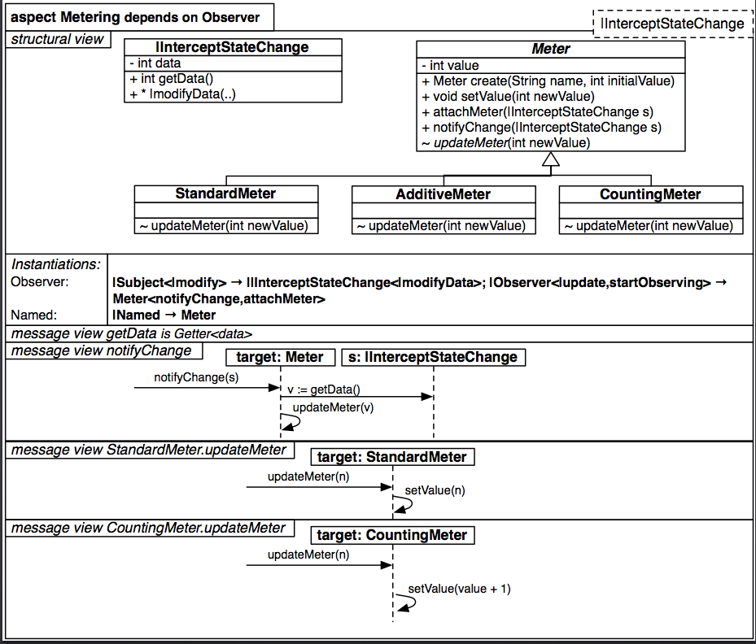

#Aspecto Metering

`

          aspect Metering dependsOnObserver {
		    mandatory {
			  |InterceptStateChange
			}
			
		    structure {
			  partial class|InterceptStateChange {
			    -int data
				+int getData()
				+ * |modifyData(int newValue)
			  }
			  
			  class Meter {
			    -int value
				+Meter create(String name, int initialValue)
				+void setValue(int newValue)
				+attachMeter(|InterceptStateChange s)
				+notifyChange(|InterceptStateChange s)
				~updateMeter(int newValue)
			  }
			  
			  class StandardMeter extends Meter {
			    ~updateMeter(int newValue)
			  }
			  
			  class AdditiveMeter extends Meter {
			    ~updateMeter(int newValue)
			  }
			  
			  class CountingMeter extends Meter {
			    ~updateMeter(int newValue)
			  }
			  
			  instantiations {
			    Observer {
				  |Subject<|modify>                 -> ||InterceptStateChange<|modifyData>
				  |Observer<|update,startObserving> -> Meter<notifyChange,attachMeter>
				}
				Named {
				  |Named                            -> Meter
				}
			  }
			  
			  messageView {
			    message getData is Getter<data>
			    message notifyChange {
				  >>           -> target:Meter             { notifyChange(s) }
				  target:Meter -> s: |InterceptStateChange { v := getData() }
				  target:Meter -> target:Meter             { updateMeter(v) }
				}
				
				message StandardMeter.updateMeter {
				  >>                   -> target:StandardMeter { updateMeter(n) }
				  target:StandardMeter -> target:StandardMeter { setValue(n) }
				}
				
				message CountingMeter.updateMeter {
				  >>                   -> target:CountingMeterMeter { updateMeter(n) }
				  target:StandardMeter -> target:CountingMeterMeter { setValue(value + 1) }
				}
			  }
			}
		  }

`
