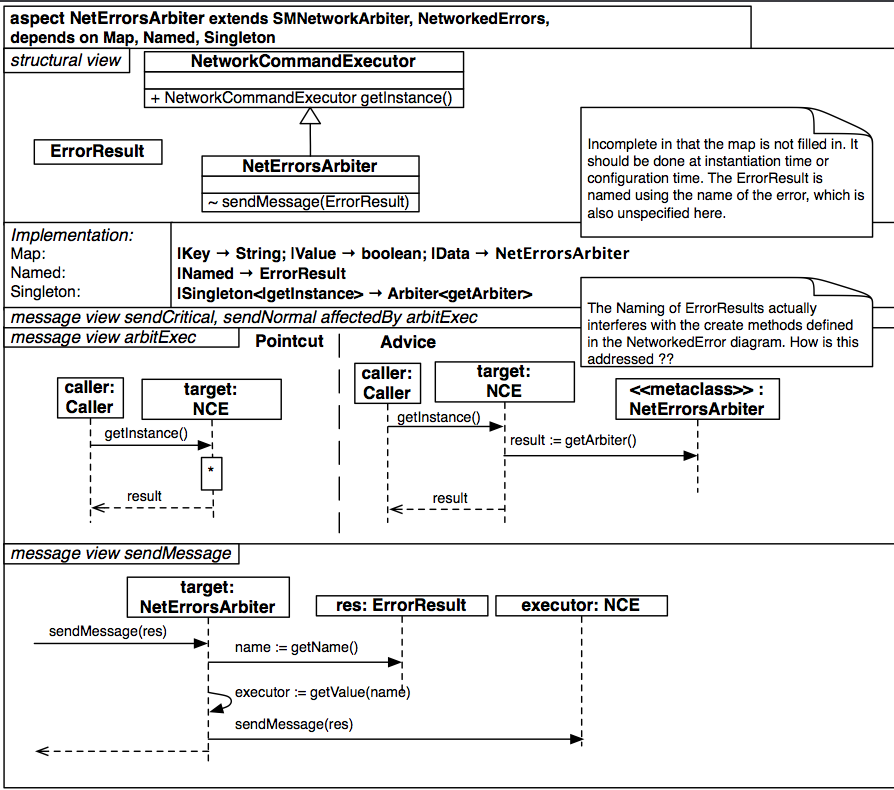

#Aspecto NetErrorsArbiter

Observaciones, en la vista de mensajes se puede declara una lista separada por comas.

`

          /**
		  *Incomplete in that the map is not filled in. It
		  *should be done at instantiation time or
		  *configuration time. The ErrorResult is
		  *named using the name of the error,
		  *which is also unspecified here.
		  */
          aspect NetErrorsArbiter extends SMNetworkArbiter, NetworkedErrors, dependsOn Map, Named, Singleton {
            structure {
			  class NetworkCommandExecutor {
			    +NetworkCommandExecutor getInstance()
			  }
			  
			  class NetErrorsArbiter extends {
			    ~sendMessage(ErrorResult)
			  }
			  
			  class ErrorResult {}
			  
			  implementations {
			    Map       { |Key → String; |Value → boolean; |Data → NetErrorsArbiter }
				Named     { |Named → ErrorResult }
				Singleton { |Singleton<|getInstance> → Arbiter<getArbiter> }
			  }
			}
			
			messageView {
			  /**
			  *The Naming of ErrorResults actually
			  *interferes with the create methods
			  *defined in the NetworkedError diagram.
			  *How is this addressed ??
			  */
			  message sendCritical, sendNormal affectedBy arbitExec
			  
			  message arbitExec {
			    pointcut {
				  caller:Caller          -> target:NCE                     { getInstance() }
				}
				
				advice {
				  caller:Caller          -> target:NCE                     { getInstance() }
				  target:NCE             -> <<metaclass>>:NetErrorsArbiter { result := getArbiter() }
				}
			  }
			  
			  message sendMessage {
			    >>                      -> target:NetErrorsArbiter         { sendMessage(res) }
				target:NetErrorsArbiter -> res:ErrorResult                 { name := getName() }
				res:ErrorResult         -> executor:NCE                    { sendMessage(res) }
			  }
			}
		  }

`
