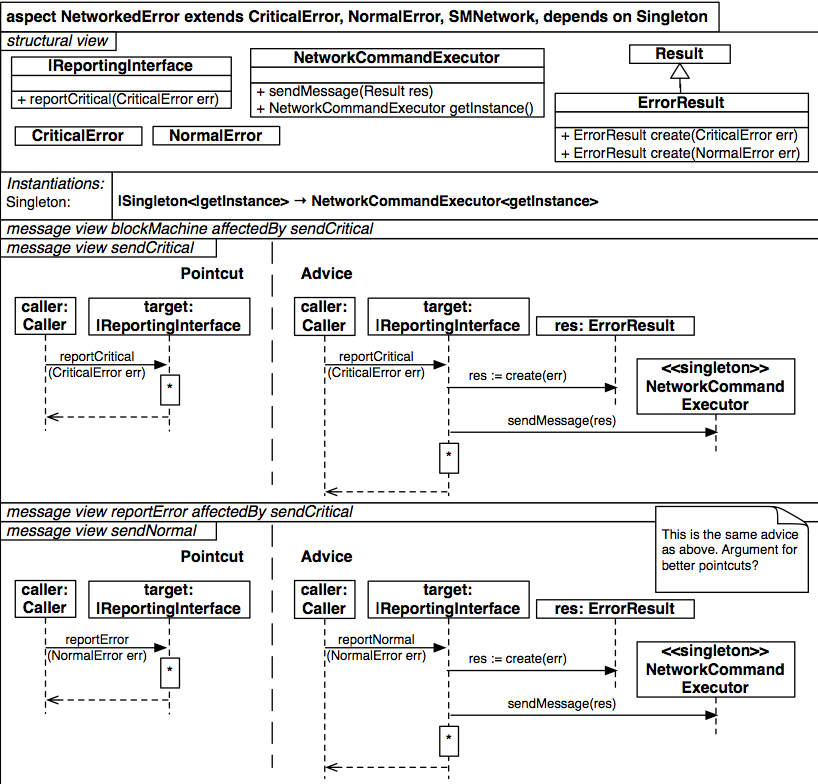

#Aspecto NetworkedError

`

          aspect NetworkedError extends CriticalError, NormalError, SMNetwork, dependsOn Singleton {
		    structure {
			  class |ReportingInterface {
			    +reportCritical(CriticalError err)
			  }
			  
			  class NetworkCommandExecutor {
			    +sendMessage(Result res)
				+NetworkCommandExecutor getInstance()
			  }
			  
			  class Result {}
			  class CriticalError {}
			  class NormalError {}
			  
			  class ErrorResult extends Result {
			    +ErrorResult create(CriticalError err)
				+ErrorResult create(NormalError err)
			  }
			  instantiations {
			    Singleton { |Singleton<|getInstance> → NetworkCommandExecutor<getInstance> }
			  }
			}
			
			messageView {
			  message blockMachine affectedBy sendCritical
			  message sendCritical {
			    pointcut {
				  caller:Caller -> target:|ReportingInterface { reportCritical (CriticalError err) }
				}
				
				advice {
				  caller:Caller              -> target:|ReportingInterface          { reportCritical (CriticalError err) }
				  target:|ReportingInterface -> res:ErrorResult                     { res := create(err) }
				  res:ErrorResult            -> <<singleton>>NetworkCommandExecutor { sendMessage(res) }
				} 
			  }
			  
			  message reportError affectedBy sendCritical
			  message sendNormal {
			    pointcut {
				  caller:Caller -> target:|ReportingInterface { reportError (NormalError err) }
				}
				advice {
				  caller:Caller              -> target:|ReportingInterface          { reportError (NormalError err) }
				  target:|ReportingInterface -> res:ErrorResult                     { res:= create(err) }
				  res:ErrorResult            -> <<singleton>>NetworkCommandExecutor { sendMessage(res) }
				}
			  }
			}
		  }

`
