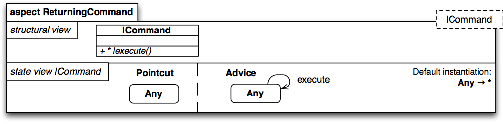

#Aspecto ReturningCommand

`

          aspect ReturningCommand {
		    mandatory {
			  |Command
			}
			
		    structure {
			  partial |Command {
			    + * |execute()
			  }
			}
			
			state {
			  pointcut {
			    Any
			  }
			  
			  advice {
			    state Any -> Any { execute }
			  }
			  
			  instantiation default {
			    Any -> *
			  }
			  
			}
		  }

`
