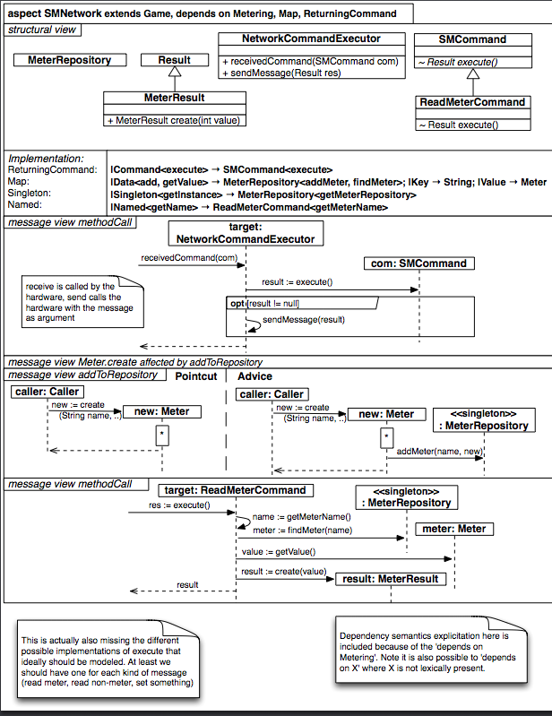

#Aspecto SMNetwork

`

          aspect SMNetwork extends Game, depends on Metering, Map, ReturningCommand {
		    structure {
			  class MeterRepository {}
			  
			  class Result {}
			  
			  class MeterResult extends Result {
			    +MeterResult create(int value)
			  }
			  
			  class NetworkCommandExecutor {
			    +receivedCommand(SMCommand com)
				+sendMessage(Result res)
			  }
			  
			  class SMCommand {
			    ~Result execute()
			  }
			  
			  class ReadMeterCommand extend SMCommand {
			    ~Result execute() 
			  }
			  
			  implementations {
			    ReturningCommand { |Command<execute>       -> SMCommand<execute> }
				Map              { |Data<add, getValue>    -> MeterRepository<addMeter, findMeter>;
				                   |Key                    -> String;
				                   |Value                  -> Meter }
                Singleton        { |Singleton<getInstance> -> MeterRepository<getMeterRepository> }
				Named            { |Named<getName>         -> ReadMeterCommand<getMeterName> }
			  }
			}

            /**
			* This is actually also missing the different possible implementations of execute that ideally should be modeled. At least we should have one for each kind of message (read meter, read non-meter, set something)
			* Dependency semantics explicitation here is included because of the 'depends on Metering'. Note it is also possible to 'depends on X' where X is not lexically present.
			*/
			messageView {
			  /**
			  * receive is called by the hardware, send calls the hardware with the message argument
			  */ 
			  message methodCall {
			     >>                              -> target:NetworkCommandExecutor { receivedCommand(com) }
				 target:NetworkCommandExecutor   -> com:SMCommand                  { result := execute() }
				 opt [ result != null  ] {
				   target:NetworkCommandExecutor -> target:NetworkCommandExecutor  { sendMessage(result) }
				 }
			  }
			  
			  message Meter.create affected by addToRepository
			  message addToRepository {
			    pointcut {
				  caller:Caller -> new:Meter { new := create }
				}
				
			    advice {
				  caller:Caller -> new:Meter                     { new := create }
				  new:Meter     -> <<singleton>>:MeterRepository { addMeter(name, new) }
				}				
			  }
			  
			  message methodCall {
			    >> -> target:ReadMeterCommand { res := execute() }
				target:ReadMeterCommand -> target:ReadMeterCommand       { name := getMeterName() }
				target:ReadMeterCommand -> target:ReadMeterCommand       { meter := findMeter(name) }
				target:ReadMeterCommand -> <<singleton>>:MeterRepository { value := getValue() }
				target:ReadMeterCommand -> result: MeterResult           { result := create(value) }
			  }
			}
		  }

`
