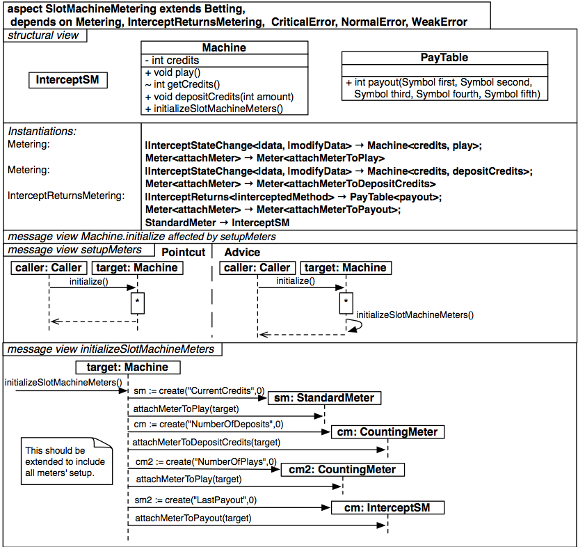

#Aspecto SlotMachineMetering

Observaciones el método *+initializeSlotMachineMeters()* de la clase *Machine* no tiene definido un tipo de dato de retorno, hay inconsistencia en el formato de definición de firmas.

`

         aspect SlotMachineMetering extends Betting, dependsOn Metering, InterceptReturnsMetering, CriticalError, NormalError, WeakError {
		   structure {
		     class InterceptSM { }
			 
			 class Machine {
			   -int  credits
			   -void play()
			   ~int  getCredits()
			   +void depositCredits(int amount)
			   +Initializeslotmachinemeters()
			 }
			 
			 class PayTable {
			   +int payout(Symbol first, Symbol second, Symbol third, Symbol fourth, Symbol fifth)
			 }
			 
			 instantiations {
			   Metering {
			     |InterceptStateChange<|data, |modifyData> -> Machine<credits, play>; Meter<attachMeter> → Meter<attachMeterToPlay>;
				 |InterceptStateChange<|data, |modifyData> -> Machine<credits, depositCredits>; Meter<attachMeter> → Meter<attachMeterToDepositCredits>
			   }
			   InterceptReturnsMetering {
			     |InterceptReturns<|interceptedMethod>     -> PayTable<payout>; Meter<attachMeter> → Meter<attachMeterToPayout>;
				 StandardMeter                             -> InterceptSM
			   }
			 }
		   }
		   
		   messageView {
		     message Machine.initialize affectedBy setupMeters
			 
			 message setupMeters {
			   pointcut {
			     caller:Caller  -> target:Machine { initialize() }
			   }
			   advice {
			     caller:Caller  -> target:Machine { initialize() }
				 target:Machine -> target:Machine { initializeSlotMachineMeters() }
			   }
			 }
			 /**
			 * This should be extended to include all meters' setup.
			 */
			 message initializeSlotMachineMeters {
			   >> -> target:Machine                { initializeSlotMachineMeters() }
			   target:Machine -> sm:StandardMeter  { attachMeterToPlay(target)     }
			   target:Machine -> sm:StandardMeter  { attachMeterToPlay(target)     }
			   target:Machine -> cm:CountingMeter  { cm := create("NumberOfDeposits",0) }
			   target:Machine -> cm:CountingMeter  { attachMeterToDepositCredits(target) }
			   target:Machine -> cm2:CountingMeter { attachMeterToDepositCredits(target) }
			   target:Machine -> cm2:CountingMeter { attachMeterToPlay(target) }
			   target:Machine -> cm:Intercept      { sm2 := create("LastPayout",0) }
			   target:Machine -> cm:Intercept      { attachMeterToPayout(target) }
			 }
		   }
		 }

`
