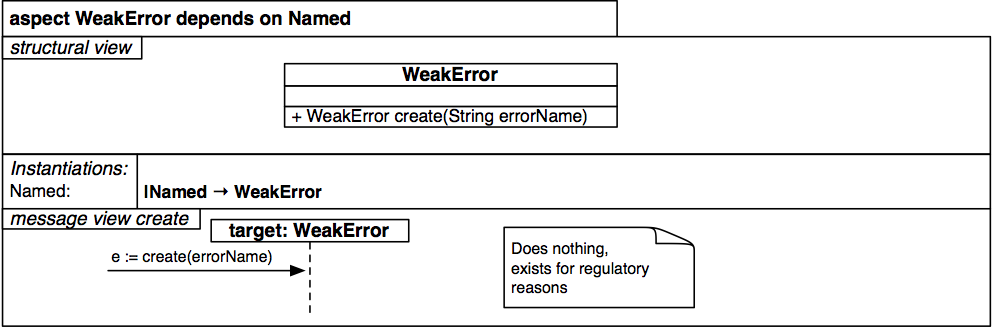

#Aspecto WeakError

`

          aspect WeakError dependsOn Named {
		    structure {
			  class WeakError {
			    +WeakError create(String errorName)
			  }
			  instantiations default {
			    Named { |Named -> WeakError }
			  }
			}

            /**
			* Does nothing, exists for regulatory reasons
			*/
			messageView {
			  message create {
			    >> -> target:WeakError { e := create(errorName) }
			  }
			}
		  }

`
