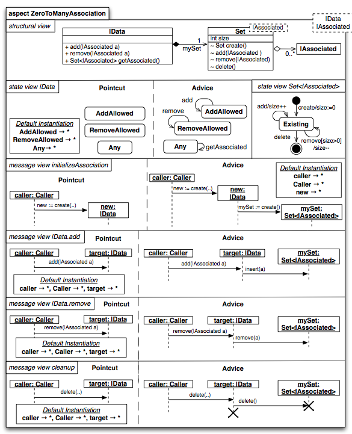

#ZeroToManyAssociation 

##Explica los puntos básicos del modelamiento de RAM
page.date 2013-11-17

El "AspectModel" ZeroToManyAssociation es una preocupación que ocurre frecuentemente en las aplicaciones. Un objeto de la clase A necesita ser asociada con muchos objetos de la clase B.

En UML está situación se puede resolver con una asociación standard que tiene la multiplicidad 0..*; por lo general se implementa por medio de (list or array) contenido en la clase A. Para asociar un objeto b con un objeto a, b es insertado dento del set contenido en a.

###Vista estructural
El diagrama de clases que representa el diseño de la estructura de ZeroToManyAssociation es presentada en la vista estructural de la figura 1. Se definen tres clases: |Data, |Associated y la clase plantilla Set.

La clase Set implementa una abstracción de set: provee un constructor y destructor, coo también operaciones para insertar y remover elementos dentro del set. Está parametrizado con la clase |Associated, por tanto la creación de "Set of |Associated".

|Data y |Associated son *clases parciales* (una clase parcial necesita ser completada antes de ser usada en la aplicación). Las clases parciales, no definen constructores y destructores, por tanto será imposible crear instancias de dichas clases. Todas las clases parciales de un aspecto, son por tanto exportadas como *parámetros de instanciación obligatorios* del aspecto, y son mostrados como parámetros de plantilla UML en la esquina superior izquierda del aspecto. Para poder usar el aspecto y tejerlo con el modelo destino, los parámetros de instaciación deben ser mapeados a los elementos del modelo desde el modelo destino.

La *interface pública* de RAM, consiste en todas las operaciones públicas declaradas por las clases dentro del aspecto. En UML, las operaciones públicas son marcadas con `+`. En el ejemplo de *ZeroToManyAssociation* solo las operaciones `add, remove` y `getAssociated`  la clase `\Data` publicamente accesibles. Las operaciones de la clase `Set` son parte de *intra-aspect interface* de *ZeroToManyAssociation* ejemplo: Ellos solo pueden ser llamados desde otros objetos que son parte del aspecto. Las operaciones de intra-aspect son etiquetadas en RAM usando el modificado uml `~`.

###Vista de mensajes
Para proveer la funcionalidad relacionada a una preocupación, los elementos del modelos de un aspecto deben colaborar en tiempo de ejecución. En RAM, la colaaboración entre objetos es visualizada en el compartimiento "*message view*" por medio del uso de diagramas de secuencia. Un aspecto de RAM debe especificar una vista de mensajes por cada operación pública que involucra intercambio de mensajes entre objetos. Si una operación pública no tiene su correspondiente vista de mensajes, se asume que solo modifica o lee el estado del objeto (como en el caso del método `getAssociated`, el cual simplemente retorna el set `mySet` al llamador).

El mensaje *initializeAssociation*, muestra el compartimiento de la primera vista de mensajes en la Figura 1. se visualiza que siempre que un constructor es invocado también se crea una instancia de la clase `Set` y almacena una referencia dentro de `mySet` (ver "*advice*" dentro del diagrama de secuencia). Esto garantiza que nunca va existir un objeto `|Data` sin el objeto `Set` que pertenece a él. La vista de mensaje *cleanup* se asegura que el set es liberado cuando el objeto `|Data` desaparece. La vista de mensaje `add` describe que el adicionar un objeto a la clas `|Associated` es hecho insertando una referencia dentro del set referenciado por `mySet`. Eliminar objetos desde la asociación, descrita en la vista de mensaje `remove`, sigue el mismo patrón.

###Vista de estados
RAM también permite al modelador visualizar el estado como el estado de un objeto dicta los mensajes que son aceptados en la  *vista de estados* con la ayuda de diagramas de estado. Por cada clase en la vista estructural que define operaciones, una vista de estado correspondiente debe ser especificado. El diagrama de estado debe poseer por lo menos una transición por cada operación que la clase define.

En la Figura 1. la vista de estado `Set<|Associated>` describe el protocolo de la clase `Set`. Especifica que después de haber sido creado, una instancia de `Set` acepta llamadas a la operación `add`, y si no está vacia, invoca `remove`, hasta que la instancia es destruida. La vista de estado `|Data` es diferente: el mensaje de estado posee un diagrama de estado para "*pointcut*" y otro para "*advice*" . La razón para esto es que `|Data` es una clase *parcial*. Es imposible especificar un diagrama de estado completo, con un estado inicial y final para una clase parcial. Sin embargo es posible, definir estados que son relevantos con respecto a las operaciones que las clases parciales ofrecen. La clase `|Data`, por ejemplo, tiene 3 estados que son importantes: `AddAllowed, RemoveAllowed` y `Any`. Ellos representan los estados por los cuales una instancia `|Data` acepta llamadas a `add, remove` y `getAssociated` respectivamente.

###Instanciación
Para poder usar el aspecto *ZeroToManyAssociation* en el modelo destino, el mismo debe instanciarse por medio del mapeo los `parámetros de instaciación obligatorios` del aspecto para modelar elementos en el modelo destino. En nuestro ejemplo, los parámetros de instanciación obligatorios son visualizado a nivel del paquete UML en la esquina superior izquierda, que son las clases: `|Data` y `|Associated`. Por ejemplo, para asociar un "*capability*" con cero o muchos "*resources*", el modelador dbe escribir la siguiente instanciación: `|Data -> Resource`, `|Associated -> Capability`. En tiempo de ejecución, un "*capability*" **c** puede ser ahora asociado con un "*resource*" **r** por medio de la llamada `c.add(r)`.
