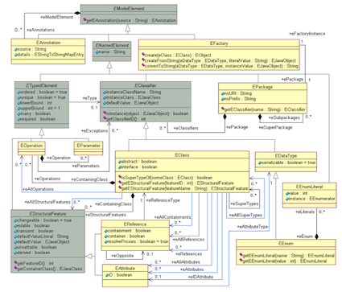
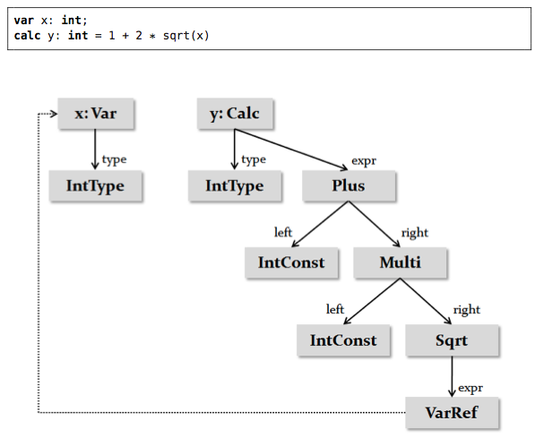

#Sintaxis Concreta y Abstracta

La sintaxis concreta (CS) de un lenguaje, es la interfaz con que interactúan los usuarios para crear programas.

La sintaxis abstracta (AS) de un lenguaje, es una estructura de datos que contiene la información principal del programa, pero sin ninguno de los detalles contenidos en la sintaxis concreta. Las instancias que representan la sintaxis abstracta, son por lo general llamadas árboles de sintaxis abstrata (AST).

Si para el usuario, la CS es la interfaz del lenguaje, la AS actua como una API para acceder a los programas por medio de herramientas de procesamiento (validadores, transformaciones y generación de código).

Hay dos formas para desarrollar un lenguaje por medio de la CS y la AS:

**Primero la CS**, la sintaxis abstracta se deriva, de la sintaxis concreta, ya sea de forma automática o por medio del uso de "*hints*" en la especificación de la sintaxis concreta.

**Primero la AS**, primero se define la AS, y luego se define la sintaxis concreta, en base a las especificaciones de la sintaxis abstracta. El meta-modelo de RAM ya existe y es basado en Ecore, por tanto TextRam utilizará este enfoque.

Una vez que el lenguaje ha sido definido, existen dos estrategias para crear programas relacionados al CS y al AS:

"**Parsing**": en este enfoque, el AST es construído a partir de la CS. Un "*parser*" instancia y popula el AS, basado en la información textual del programa. (la definición formato del CS es llamada *gramática*).

"**Projection**": en este enfoque, el AST, es contruído en forma directa por las acciones del editor, y la sintaxis concreta se representa por medio de las reglas de proyección de AST. 

##Tecnología de la generación del "Parser"
En compiladores tradiconales e IDEs, los *parsers* son escritos manualmente, por medio de grandes programas monolíticos que leen un flujo de carácteres y utilizan la recursión para crear la estructura de árbol.

En contraste, "*language workbenches*", y muchos de los compiladores actuales, generan un "*parser*" por medio de una definición formal llamada gramática.

La **gramática**, es una especificación de sintaxis escrita para un DSL, por medio de la definición textual de una sintaxis concreta.

Existe un "trade-off" con el uso de los "parsers":

por una parte los "parser" generados no ofrecen el mismo rendimiento o reporte de errores en comparación con un "parser" hecho a la medida por un experto; sin embargo los "parser" generados, disminuyen en gran medida el esfuerzo de construcción, además el desarrollador que define el lenguaje no tiene que ser un experto en la tecnología de "parsers".

##Gramática
La gramática, es la definición formal de una sintaxis concreta textual.
Consiste en la producción de reglas que definen como debe verse una entrada válida de texto. La gramática es la base para la definición de sintaxis basada en texto.

>Resumen de la definición de la gramática según xtext documentation o el libro de xtend

##Características de los formalismos del AST
Los formalismos de AST (también llamados meta-modelos), son utilizdos para representar árboles o grafos. usualmente, dicho formalismo es "meta circular" en el sentido que puede describirse asi mismo.

###EMF Ecore
"Eclipse Modeling Framework" (EMF), es el núcleo de las herramientas de modelado de Eclipse. Expone una amplia varidad de servicios y herramientas para persistir, editar y procesar modelos y definiciones de la sintaxis abstracta.

Su componente principal es *Ecore*, que actua como meta-modelo de los modelos EMF. Xtext usa  Ecore, como base para el AS: a partir de la definición de la gramática. Xtext deriva el AS como una instancia de Ecore.

Los conceptos centrales de Ecore son:
1. *EClass*, representación de los elementos del AS o conceptos del lenguaje.
2. *EAtrribute*, representación de las propiedades primitivas de EClasses
3. *EReference*, representación de asociaciones entre EClases. Los EReferences opcionalmente pueden tener semántica de contenedores. 
4. *EObject*, representación de instancias de EClasses (por ejemplo nodos AST). Cada EObject puede ser contenido de al menos una instancia de EReference.

Voelter, resume el modelo de Ecore en la Figura 1.

##"Scoping and Linking"

"**Scoping**" es el mecanismo principal detrás de la visibilidad y la resolución de referencias cruzadas. Desde el momento en que el DSL necesita estructurar el código, se necesita una implementación de "scoping".

Por lo general, el "scope" de una referencia cruzada en particular, depende de:

1. El espacio de nombres en donde viven los elementos.
2. La ubicación dentro de la gran estructura del sitio que contiene la referencia cruzada.
3. Algún aspecto, que no necesariamente es estructural por naturaleza.

El uso del "scope" puede ser:
1. Popular el menu del "code-completion" del IDE cuando el usuario presiona `Ctrl-Space` en el sitio referenciado.
2. Idenpendientemente del IDE, el "scope" es usado para verificar la validez de una referencia existente.

"**Linking**" se refiere a la resolución de referencias basadas en nombre a referencias basadas en símbolos dentro de un lenguaje que utiliza un "parser".

La sintaxis abstracta, en su forma más simple puede ser reducida a un árbol. Por lo general la información representada por un programa, es semáticamente un grafo, adicionalmente a la jerarquía de contención de un árbol, contiene referencias cruzadas no contenidas.

El reto es el siguiente: ¿cómo obtener el "árbol sintáctico" a partir del "árbol semántico"

Muchos formalismos del AST (también llamados meta-modelos), son

##"Constraints"
No todos los programas que están conforme con la estructura de un lenguaje (gramática, AS, meta-modelo), son válidos. Las definiciones del lenguaje incluyen restricciones que no pueden ser expresadas solamente por la estructura. Dichas restricciones adicionales son llamadas "constraints".

Los "constraints" son condiciones "Boolean" que debe ser evaluadas como verdaderas, para poder indicar la validez de un modelo. Un mensaje de error debe ser reportado si la epresión a evaluar es falsa.

Se pueden distinguir dos grandes tipos de "constraints":

1. "Constraints" bien formados. Ejemplos: unicidad de los nombre en una lista de elementos, todas las variables deben estar definidas antes de utilizarlas.

  2. Sistema de tipos: las reglas de los sistemas de tipos, son diferentes porque verifican la correcta definición de los tipos dentro de un programa. Por ejemplo, el sistema de tipos se asegura que no se pueda asignar un `float` a un `int`.

  Los "constraints" pueden ser implementados por cualquier lenguaje o framework que pueda consultar un modlo y reportar los errores al usuario.

  Un lenguaje que quiera expresar "constraints" eficientes, debe soportar las siguientes características.

  1. Debe permitir navegar y filtrar el modelo. Puede ser útil el soporte de "path expressions" (por ejemplo: `aClass.operations.arguments.type` como una forma de buscar el tipo de los argumentos de todas las operaciones de una clase).

  2. Se sugiere soportar "higher-order functions", para la escritura de algoritmos genéricos y estrategias transversales.

  3. Es útil poder asociar un "constraint" en forma declarativa con los conceptos del lenguaje (o patrones estructurales) para aquellas instancias que necesiten se ejecutadas.

  ##Sistema de tipos

  Los sistemas de tipos, implementan calculaciones de tipos y verificaciones de tipos.

###Conceptos básico del sistema de tipos
  Para introducir los conceptos básicos del sistema de tipos, se hará uso del AST de la Figura 2.

El AST de la Figura 2, contiene cajas que representan instancias de los conceptos del lenguaje, las líneas sólidas representan contenedores y las líneas punteadas representan referencias-cruzadas.

Un sistema de tipos debe:

1. *Declarar "Fixed Types"*: algunos elementos de los programas tienen "fixed types". Los mismos no deben ser derivados o calculados. Por lo general permanecen igual y son conocidos por anticipación. Un ejemplo es la constante entera `IntConst` (cuyo tip es `IntType`), el concepto de raíz cuadrada `sqrt` (cuyo tipo es `double`), así como las declaraciones de tipos por si mismas (el tipo de `IntType` es `IntType`, el tipo de `DoubleType` es `Double-Type`).

2. *Derivar tipos*: Para algunos elementos del programa, el tipo debe se derivado a partir de los tipos de otros elementos. Por ejemplo, el tipo `VarRef` (variable de referencia) es el tipo de la variable referenciada. El tipo de la variable es el tipo de su tipo declarado. Por ejemplo, el tipo de `x` y de la referencia a `x` es `IntType`.

*Calcular tipos comunes*, muchos de los sistemas de tipo, tiene alguna especie de jerarquía de tipos. En el ejemplo, `IntType` es un subtipo de `DoubleType` (por tanto, `IntType` puede ser usado, siempre que `DoubleType` sea esperado). El sistema de tipos debe soportar la especifcación de relación de subtipos.

*Verificaciones de tipo*: finalmente, un sistema de tipo debe verificar los errores de tipo y reportarlos al usuario. Para cumplir este objetivo, el lenguaje específica verificaciones del lenguaje, que son revisadas en tiempo de edición por el sistema de tipos, basado en los tipos calculados. En el ejemplo, un error de tipo puede ocurrir si algo con `DoubleType` fuera asignado a una variable `IntType`.
