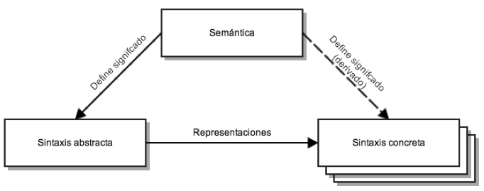

#Introducción a los Lenguajes de Especificación de Dominio (DSL)

En todas las ramas de la ciencia y la ingeniería, se pueden distinguir
dos enfoques: genéricos y específicos. Los enfoques
genéricos proporcionan una solución general para los problemas de un
área en particular, pero su solución puede no ser óptima. Un enfoque
específico, proporciona una mejor solución para un conjunto pequeño de
problemas.

En las ciencias de la computación, esta dicotomía existe con los
lenguajes de programación general (GPLs) y los lenguajes de
especificación de dominio (DSLs).

Un **lenguaje de especificación de dominio** (DSL) es un lenguaje de programación o un lenguaje de especificación ejecutable que ofrece, a partir de notaciones y abstracciones adecuadas, un poder de expresividad enfocado y por lo general restringido a un problema de dominio en particular [1].

**Lenguaje de especificación de dominio**, es un lenguaje de programación de computadoras, con expresividad limitada, enfocado en un dominio en particular [2].

De la definición anterior, se pueden destacar 4 elementos:

1. *Lenguaje de programación de computadoras*: Un DSL es usado por
   humanos para instruir a la computadora que realice cierta acción.

2. *Naturaleza del lenguaje*: Un DSL es un lenguaje de programación, y
   como tal, debe tener una sensación de fluidez, en donde la
   expresividad, debe originarse no solo de expresiones individuales, si no
   que también de la forma en que la mismas pueden ser compuestas como
   un conjunto.

3. *Expresividad limitada*: Un lenguaje de programación general
   proporciona muchas capacidades: soporte datos variables, control y
   abstracción de estructuras. Todo esto es útil, pero es más difícil
   de aprender y usar. Un DSL soporta, un conjunto mínimo de
   funcionalidades para soportar un dominio. No se puede construir un
   software entero con un DSL, en lugar de eso el DSL se concentra en
   un aspecto en particular de un sistema.

4. *Enfoque en el dominio*: Un lenguaje limitado, es solamente útil si
   tiene un enfoque claro en un dominio pequeño. El enfoque al
   dominio, es lo que convierte a un lenguaje limitado en algo de
   real valor.

##Lenguajes de programación general vs lenguajes de especificación de dominio

Todos los GPLs, están conformes con las especificaciones de Turing;
por tanto, pueden ser utilizados para implementar cualquier
artefacto compatible con un máquina de Turing.

Entonces, ¿Por qué existen diversos GPLs?
todo depende de la estrategia de ejecución. El código *C* es
compilado a un código nativo eficiente. Mientras que *Ruby* es ejecutado
por una máquina virtual (una combinación entre compiladores e
interpretes).

Las características que ofrecen cada uno de los lenguajes, están
optimizadas para las tareas que son relevantes a sus respectivos
dominios. Por ejemplo, en *C* se puede manipular la memoria (aspecto
importante para comunicarse con dispositivos de bajo nivel). Por otro
lado, en *Ruby* se pueden utilizar "*closures*" para posponer la
implementación de un comportamiento. La meta-programación de *Ruby*,
permite definir DSLs que son adecuados para el desarrollo de
aplicaciones Web (El "framework *Rails*" por ejemplo).

Incluso en el campo de los GPLs, existen diferentes
lenguajes, cada uno exponiendo diferentes funcionalidades, ajustadas
a una tarea específica. Entre más específica se vuelve una tarea, es
más adecuado el uso de lenguajes especializados. Un DSL, simplemente
es un lenguaje que está optimizado para una clase de problemas en
particular, llamados dominios.

Los lenguajes de especificación de dominio, sacrifican cierta
flexibilidad para expresar cualquier tipo de programa, en favor de la
productividad y precisión de programas relevantes en un dominio en
particular.  Por tanto, los DSL son restringidos a la creación de
programas correctos.

A continuación se presenta una tabla comparativa entre DSLs y GPLs:

<table>
  <tr style="border-bottom:1pt solid black;">
    <td></td>
    <td>GPLs</td> 
    <td>DSLs</td>
  </tr>
  <tr>
    <td>Dominio</td>
    <td>largo y complejo</td> 
    <td>pequeño y bien definido</td>
  </tr> 
  <tr>
    <td>Tamaño del lenguaje</td>
    <td>largo</td> 
    <td>pequeño</td>
  </tr>
  <tr>
    <td>Completitud de Turing</td>
    <td>Siempre</td> 
    <td>No, por lo general</td>
  </tr> 
  <tr>
    <td>Abstracciones definidas por el usuario</td>
    <td>Sofisticadas</td>   
    <td>Limitadas</td>
  </tr>
  <tr>
    <td>Ejecución</td>
    <td>Por medio de un GPL intermedio</td> 
    <td>Nativa</td>
  </tr>
  <tr>
    <td>Tiempo de vida</td>
    <td>Años/décadas</td> 
    <td>Meses/años (dependiendo del contexto)</td>
  </tr> 
  <tr>
    <td>Diseñado por</td>
    <td>Gurú o comité</td> 
    <td>Pocos ingenieros y expertos del dominio</td>
  </tr>
  <tr>
    <td>Evolución</td>
    <td>Lenta y estándar</td> 
    <td>Rápida</td>
  </tr>
  <tr>
    <td>Depreciación/cambios incompatibles</td>
    <td>Imposible, por lo general.</td>
    <td>Factible</td>
  </tr>
</table>

*Tabla 1. Comparación entre GPLs y DSLs.*

##Ingredientes de un lenguaje de programación

Un DSL y un GPL, deben tener los siguientes ingredientes principales [3]:

1. *Sintaxis concreta*,  define la notación que usarán los usuarios para definir los programas. Es la representación específica del lenguaje a modelar.

2. *Sintaxis abstracta*, es la estructura de datos que persiste la semántica de la información relevante expresada por un programa. Por lo general es un árbol o un gráfico. No debe contener detalles de notación.

3. *Semántica*,  describe el significado de los elementos definidos en el lenguaje y el significado de combinar dichos elementos.

La Figura 1, muestra la relación entre los tres ingredientes: la semántica define el significado de la sintaxis abstracta e indirectamente el de la sintaxis concreta; la sintaxis concreta representa la sintaxis abstracta.

##Clasificación de los DSLs

Los DSLs se pueden clasificar en dos categorías:

1. *DSL externo*, es un lenguaje de programación que se construye,
   desde cero y tiene una infraestructura independiente para el
   análisis léxico, técnicas de parseo, interpretación y generación de
   código. [6].

2. *DSL interno*, es un lenguaje que utiliza la infraestructura de un
   lenguaje de programación existente; para construir la semántica de
   especificación de dominio encima de él. (ejemplo:
   "Rails en Ruby"). Los DSL internos, están embebidos dentro de un
   lenguaje de programación general. Usualmente, el lenguaje "*host*"
   es de tipos dinámicos y la implementación del DSL es basada en
   meta-programación.
   

**TextRam** será construido por medio de un DSL externo. Los motivos
son los siguientes:

1. La construcción de un DSL externo, ofrece libertad sintáctica,
   por tanto el creador del lenguaje puede utilizar la sintaxis que
   más estime conveniente.

2. Los DSLs internos, a veces se apoyan en trucos obscuros del lenguaje
   "host" para producir una sintaxis fluida (Fowler en [2]).

2. En clásicas implementaciones de los DSLs internos, el entorno
   integrado de desarrollo (IDE), no estan al tanto de la gramática y
   otras restricciones propias de un DSL. Por tanto, en caso de error,
   no puede dar una  retroalimentación útil al usuario.

3. **TextRam**, tiene como objetivo transformar la representación
   textual a dos representaciones: representación visual con
   Graphiz [4] y a la representación de modelos en RAM (Ecore). Dichas
   transformaciones, son más fáciles de realizar con la ayuda de un DSL externo.

##Ingeniería de Software Orientada a Modelos (MDSE)
MDSE es un marco de trabajo conceptual unificado en donde todo el
ciclo de vida del software es visto como un proceso de producción,
refinamiento e integración de modelos [5]. MDSE es una metodología
para aplicar las ventajas del modelado a las actividades de ingeniería
de software. En el contexto del MDSE, el software se obtiene como
resultado de la siguiente ecuación:

> Modelos + Transformaciones = Software [3].

El lenguaje de modelado es la notación por la cual se expresan los
modelos y las transformaciones. El proceso dirigido por modelos define
que tipos de modelos (orden de los mismos y su nivel de abstracción)
son necesarios de acuerdo a un determinado tipo de software.

La definición y el uso de DSLs es un sabor del MDSE, que se aplica por
medio de la creación de representaciones formales, que son específicas
a un aspecto particular de un sistema de software y son procesables
con la ayuda de herramientas. 

MDSE proporciona una visión exhaustiva para el desarrollo de
sistemas. La Figura 2, es un vistazo general de los principales aspectos
considerados en MDSE, y resume como los diferentes problemas son
resueltos de acuerdo a las siguientes
dimensiones ortogonales: conceptualización (columnas) e
implementación (filas).

El problema de *implementación* se resuelve con el pareo de modelos a
un sistema de software existente o por definir. Consiste en la
definición de tres conceptos:

1. El nivel de modelamiento: define los modelos.
2. El nivel de realización: implementa soluciones, a través de
   artefactos que son usados dentro de sistemas en ejecución (código
   en caso de software)
3. Nivel de automatización: resultado de la correspondencia entre los niveles de modelamiento y realización.

Los problemas de *conceptualización*, están orientados a definir
modelos conceptuales para describir la realidad. Esto puede ser
aplicado en varios niveles:

1. Nivel de aplicación: lugar en donde se definen los modelos de las aplicaciones, las reglas de transformación son aplicadas, y los componentes del sistema en ejecución son generados.
2. Nivel del dominio de aplicación: define el lenguaje de
   modelamiento, transformaciones, y plataformas de implementación para
   un dominio específico.
3. Nivel meta: la conceptualización de los modelos y transformaciones
   son definidos.

El flujo principal del MDSE, parte con los modelos de aplicación hasta
la realización, a través de transformaciones subsecuentes del
modelo. Esto permite la reutilización de modelos y ejecución de
sistemas en diferentes plataformas.

Esto es posible, gracias a la especificación de modelos, de acuerdo a
un lenguaje de modeldo, a su vez definido conforme a un lenguaje de meta-modelado.

Es posible definir modelos de la realidad y luego modelos que
describen modelos (meta-modelos), después modelos recursivos que
describen meta-modelos (llamados meta-meta-modelos). En teoría, se
pueden definir instancias infinitas para los niveles de los
meta-modelos, pero en la práctica, se ha demostrado que los
meta-meta-modelos se pueden definir así mismos.
La figura 3, muestra un ejemplo completo de meta-modelado.

Los meta-modelos pueden ser útiles para:

1. Definir nuevos lenguajes para el modelado o programación.
2. Definir nuevos lenguajes de modelado para intercambiar y almacenar
   información.
3. Definir nuevas propiedades y funcionalidades que pueden ser
   asociadas a información existente (meta data)

#Referencias

1. VAN DEURSEN, A., KLINT, P., AND VISSER, J. 2000. Domain-specific
   languages: An annotated bibliography. ACM SIGPLAN Notices 35, 6
   (June), 26–36.

2. M. FOWLER. Domain-Specific Languages, Addison Wesley, 2010.

3. BOBADILLA M., CABOT J., WIMMER M., Model-Driven Software Engineering in Practice, Morgan & Claypool Publishers, 2012

4. http://www.graphviz.org/

5. SCHMIDT, D.C.: Model-driven engineering. IEEE Computer 39, 41–47
   (2006)

6. DEBASISH GHOSH: DSL in Action, Manning Publications, 2010.
