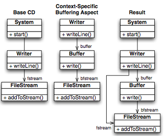

#Aspect-Oriented Multi-View Modeling

##Introducción
El modelamiento multi-vista permite describir el software desde distintas perspectivas, con la ayuda de diferentes notaciones de modelado. El modelado multi-vista enfreta dos retos: *escalabilidad* y *consistencia*. En aplicaciones complejas, los modelos tienden a crecer en tamaño, a un punto tal que incluso las vistas individuales son díficiles de entender.

Las técnicas de orientación a aspectos, han resuelto el problema de identificación y de modularización de preocupaciones transversales, lo que permite al desarrollador razonar sobre una preocupación individual. Por tanto, estas técnicas tienen el potencial para resolver los problemas de escalabilidad y consistencia, inherentes al modelado multi-vista.

Los enfoques existentes de modelado orientado a aspectos (AOM), se han convertido en una estrategia existosa para separar y componer modelos. En el contexto del modelado multi-vista, AOM puede ser aplicado sobre vistas individuales resolver el problema de la escalabilidad. Sin embargo, esto tiene una consecuencia: la dificultad de asegurar la consistencia entre modelos.

*"Reusable Aspect Models"* (RAM) es un enfoque de modelamiento orientado a aspectos que permite crear modelos en forma escalable y consistente entre múltiples vistas. RAM permite expresar la estructura y el comportamiento de sistemas complejos, por medio de diagramas de clase, estado y secuencia en un paquete UML especial llamado "aspect model". En el enfoque de RAM, cualquier preocupación o funcionalidad reutilizable, es modelado como aspecto. No importa si el aspecto se utiliza solo una vez dentro de una misma aplicación, dicho aspecto puede ser reutilizado de nuevo en otras aplicaciones. RAM recomienda modelar aspectos simples y pequeños.

Las características de RAM son:
 
1. Integración de diagramas de clase, estado y de secuencia por medio de las técnicas de modelado orientado a aspectos.
2. Reutilización de “aspect models” en forma segura y flexible.
3. Soporta la creación de complejas cadenas de dependencia. Esto permite modelar aspectos de funcionalidad compleja, descomponiéndolos en aspectos que proveen una funcionalidad simple.
4. Ejecuta revisiones de consistencia para verificar la correcta composición de aspectos y su reutilización.
5. Define un detallado algoritmo de “weaving” que resuelve la dependencia de aspectos para generar “aspect models” independientes que son aplicados en el modelo final.

##Antecedentes del modelamiento orientado a aspectos

###Composición de los diagramas de clases

La técnica de composición de modelos que utiliza RAM, es basada en el enfoque propuesto por France en [77,77], dicho enfoque compone modelos que presentan diferentes vistas del mismo concepto. Para que esto sea posible, se deben cumplir dos requisitos:

1. Los elementos del modelo a componer deben ser del mismo tipo sintáctico.
2. Los elementos del modelo a componer deben ser instancias de la misma clase del *meta-modelo*.

En ocasiones, una vista de aspecto describe elementos que no están presentes en el modelos destino y viceversa, en estos casos, dichos elementos son incluidos en modelo final compuesto.

*"Element matching"* se llama al proceso de identificar elementos del modelo a componer. Para soportar en forma automática el "*element matching*", cada tipo de elemento, es asociado con una firma que determina su unicidad dentro del espacio de tipos: dos elementos con firmas equivalentes representan el mismo concepto, por tanto son compuestos.

####Ejemplo

La Figura 1, es un ejemplo de composición de diagramas de clase.

El ejemplo presenta un diagrama de clases base, en donde hay una entidad que produce salidas (clase *"Writer"*) a un dispositivo de salida (clase *"FileStream"*). El objetivo es desacoplar la producción de salida de sus dispositivos, por medio de un *"Buffer"*; esto se logra gracias a la definición de un modelo de aspecto que incluye la clase *"Buffer"* y a la unión de dicho aspecto con el diagrama de clases base. El ejemplo muestra el resultado final de esta composición de clases.

###"Weaving" de los diagramas de estado y secuencia.

Para *tejer* los diagramas de estados de aspectos, se deben especificar dos tipos de diagramas:

1. Un diagrama de estados para el *"pointcut*" (especificación del comportamiento a detectar)
2. Un diagrama de estados para el *"advice"* (comportamiento esperado para cada *"join point"*).

El resultado de este enfoque es la extensión del comportamiento con uno nuevo o la eliminación de este.

Este enfoque puede extender 

En *AspectJ* el comportamiento de los aspectos puede ser insertado alredeor (*"around"*), antes ("*before*") o después ("*after*") de un "*join point*"

Si se desea *tejer* un diagrama de estados de aspectos en un diagrama de estados destino, el diagrama de estado de aspectos es compuesto por un  par de diagramas de estado:

1. Uno para el pointuct (especificación del comportamiento a detectar)
2. Otro diagrama de estado para el Advice, representado el comportamiento esperado en cada *"join point"*. Igualmente que en *AspectJ* en donde el comportamiento de aspectos puede ser insertado *"around"*, "*before*" o "*after*" de un *"join point"*, un aspecto puede extender el comportamiento matcheado, remplezando con un nuevo comportamiento o removiendolo completamente.

En RAM una preocupación tiene 3 tipos diferentes de vistas: vista estructural, vista de estados y vista de mensajes; dichas vistas son agrupados en un paquete UML especial llamado *"aspect model"*

###Vista estructural

Es el primer compartimento de un *"aspect model"*. Se expresa por medio de diagramas de clase, por tanto define atributos, métodos y asociaciones. Los miembros de clase pueden tener tres tipos de visibilidad:

1. Miembros privados: los métodos solo son visibles dentro de la clases en donde fueron definidos. Estos métodos se anotan con el carácter `-`
2. Miembros públicos: representan la interfaz pública de los aspectos de RAM y son visibles al exterior del paquete de aspectos. Estos métodos se anotan con el carácter `+`
3. Miembros inter-aspectos: únicamente pueden ser llamados desde otros objetos que son parte del aspecto. La anotación de deasdfdas es por medio del caracter `~`.

####Completitud de la clases
Las clases dentro de la vista estructual no necesitan estar completas. Dichas clases solo necesitan especificar los miembros que son relevantes dentro de la preocupación modelada. La clases incompletas reciben el nombre de clases parciales.

Las clases parciales, necesitan ser completadas antes de ser usadas dentro de la aplicación. Las clases parciales no definen contructores o destructores, por tanto sería imposible crear instancias de dichas clases. Todas las clases parciales de un aspecto son exportadas como *parámetros de instanciación obligatoria*; dichos parámetros son representados en la esquina superior derecha del paquete de aspectos. Para poder usar el aspecto y tejerlo con el modelo destino, los parámetros de instanciación obligatoria deben ser mapeados a los elementos del modelo del diagrama de clases destino.

Las clases pueden luego se compuestas por el "*weaver*" con otras clases cuando el aspecto es instanciado o enlazado a un modelo base, para terminar con una clase completa.

Las clases parciales, necesitan ser completadas antes de ser usadas dentro de la aplicación. Las clases parciales, no definen constructores y destructores, por tanto será imposible crear instancias de dichas clases. Todas las clases parciales de un aspecto, son por tanto exportadas como *parámetros de instanciación obligatorios* del aspecto, y son mostrados como parámetros de plantilla UML en la esquina superior izquierda del aspecto. Para poder usar el aspecto y tejerlo con el modelo destino, los parámetros de instanfdf7ciación deben ser mapeados a los elementos del modelo desde el modelo destino.

Después se puede realizar una composición de clases por medio del uso del *"weaver"* enlazando o instanciando el modelo de aspectos con el modelo de clases base 

La vista estructural es el primer compartimiento de un *"aspect model"*. Se expresa por medio de los diagramas de clase y por lo tanto contiene clases con atributos, métodos y asociaciones. Los métodos públicos pueden ser usados al exterior del paquete de aspectos, y es anotado con el carácter `+`. Las clases dentro de la vista estructural no necesitan estar completas, ellas solo necesitan especificar los atributos, métodos y asociaciones que son relevantes dentro de la preocupación que es modelada. Las clases pueden después ser compuesta por el *"weaver"* con otras clases cuando el aspecto es instanciado o enlazado con el modelo base para completar un clase.

Clases incompletas, son entidades que nos están directamente o indirectamente enlazadas con elementos del modelo de otro modelo de aspectos, y métodos cuyos nombres y firmas son aun determinadas

###Vista de estados
Los mensajes que son aceptados dentro del estado de un objeto, son representados en RAM por medio de la vista de estados. La vista de estados es la segunda sección dentro de un "*aspect model*". Los estados representan el estado interno de una entidad relevante dentro de la preocupación a modelar. La relevancia de un estado se define por los mensajes que la entidad es capaz de procesar.

####Reglas para definir una vista de estados:

1. UML es la notación que se utiliza para representar la vista de estados. En términos UML, la vista de estados describle el *protocolo de uso* de la entidad.
2. La vista de estados se construye tomando cada una de las clases (completas o incompletas) definidas en la vista estructural.
3. Para que la vista de estado este completa, el diagrama de estados debe contener cada método definido en la vista estructura al menos una vez.
4. La vista de estados se debe de representar de acuerdo a la completitud de las clases en la vista estructural (ver: representación de la vista de estados)

####Representación de la vista de estados

Dependiendo de la completitud de las entidades en la vista estructual, una vista de estado se puede representar de dos formas:

1. Si la clase es completa: la vista de estado toma la forma de un diagrama de estados estandar para definir el protocolo de la entidad.
2. Para clases incompleta:, se debe definir un *diagrama de estados de aspectos* que consiste en un "*pointcut*" y un "*advice*". El "*pointcut*" define los estados y transiciones que deben existir en el diagrama de estados destino. El "*advice*" define (o redefine) el diagrama de estados que reemplazará las ocurrencias del "*pointcut*" en el diagrama de estados destino. Al igual que en la vista estrucutal, los estados que no están enlazados directamente o indirectamente son llamados *parámetros de instanciación obligatoria* (también son colocados en la esquina superior derecha y representados con el carácter `|` como prefijo.

###Vista de mensajes
La última sección del "*aspect model*" es la vista de mensajes. Para proveer la funcionalidad relacionada a un preocupación, los elementos del modelo dentro del aspecto deben colaborar en "*run-time*". En RAM, la colaboración entre objetos es representada por medio de la vista de mensajes.

####Reglas para definir una vista de mensajes.

1. La notación utilizada para describir la vista de mensajes son los diagramas de secuencia de UML.
2. Se debe definir una vista de mensajes para cada operación pública que involucra intercambio de mensajes entre objetos en la vista estructural.
3. Los mensajes que se deben incluir son aquellos que muestra un intercambio de mensajes entre entidades cuando proveen la funcianalidad de cada método público. Los mensajes que no se incluyen son aquellos que solo representan una computación interna de la entidad y no un intercambio de mensajes entre entiades.

####Representación de la vista de mensajes

la vista de mensajes contiene un *diagrama de secuencia de estados* que consiste en un "*point cut*" y un "*advice*" El "*pointcut*" define, la entidades y el intercambio de mensajes que deben de existir en el diagrama de secuencia destino. El "*advice*" especifica el diagrama de secuencia que reemplazará la ocurrencia del "*pointcut*" en el diagrama destino.

Por lo general, el "*pointcut*" muestra un llamador ("*caller*"), que invoca la operación de la instancia de la entidad que define el método. El "*advice*" entonces, muestra los detalles de ejecución de dicho método. 

En ocasiones especiales, el "*pointcut*" puede representar comportamientos más complejos: mensajes de secuencia entre distintos objetos. En estos casos, el "*advice*" muestra como los mensajes adicionales son adicionados dentro del comportamiento especificacdo en el "*pointcut*" o inclusive como los mensajes "*matchados*" son reemplazados.

###Dependencia de aspectos, reutilización, enlaces e instanciación.
Uno de los objetivos de RAM, es proveer escalabilidad por medio del modelamiento multi-vista. Para mantener los "*aspect models*" relativamente pequeños, los aspectos que proveen una funcionalidad compleja deben tener la capacidad de reutilizar funcionalidad simple proveida por otros aspectos.

Si un aspecto `A` reutilizar modelos proporcionado por un aspecto `B`, entonces `A` *depende* de `B`. Las dependencias deben ser mostradas en el encabezado del paquete de aspectos. Ejemplo: `aspect A depends on B`.

####Instanciación
Para ejemplificar la instanciación, vamos a suponer que tenemos dos "*aspect models*": `A` y `B`. `A` tiene una clase parcial `|X` y `B` tiene una clase parcial `|Y`. A continuación se detallará como se debe realizar la instanciación en las diferentes vistas del *aspect model*; para ellos hay que considerar de que `A` depende de `B`.

**Vista estructural**. `A` debe proporcionar al menos una *directiva de instanciación* que corresponda a los *parámetros de instanciación obligatoria* de la vista estructural de `B`. Clases en `B` que no son *parámetros de instanciación obligatoria* pueden ser instanciados en forma opcional.

**Vista de estados**. La vista de estados de `A` debe corresponder todos los parámetros de instanciación obligatorios, definidos en la vista de estados de `B`; dicha instanciación se hace mapeando los estados incompletos de `B` con los estados de `A` en la directiva de instanciación de la vista de estados de `A`.

**Vista de mensajes** Sucede lo mismo en la vista de mensajes, si `A` desea reutilizar `B`; todos los parámetros de instanciación obligatoria de `B` deben ser correspondidos en la directiva de instanciación de la vista de mensajes de `A`.

####Enlazamiento (Binding)

