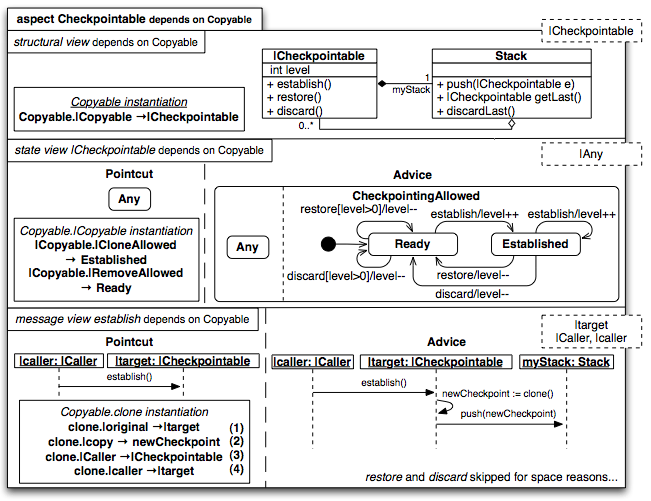

#Aspect-Oriented Multi-View Modeling

##Introducción
El modelamiento multi-vista permite describir el software desde distintas perspectivas, con la ayuda de diferentes notaciones de modelado. El modelado multi-vista enfreta dos retos: *escalabilidad* y *consistencia*. En aplicaciones complejas, los modelos tienden a crecer en tamaño, a un punto tal que incluso las vistas individuales son díficiles de entender [1].

Las técnicas de orientación a aspectos, han resuelto el problema de identificación y de modularización de preocupaciones transversales, lo que permite al desarrollador razonar sobre una preocupación individual. Por tanto, estas técnicas tienen el potencial para resolver los problemas de escalabilidad y consistencia, inherentes al modelado multi-vista.

Los enfoques existentes de modelado orientado a aspectos (AOM), se han convertido en una estrategia existosa para separar y componer modelos. En el contexto del modelado multi-vista, AOM puede ser aplicado sobre vistas individuales resolver el problema de la escalabilidad. Sin embargo, esto tiene una consecuencia: la dificultad de asegurar la consistencia entre modelos.

*"Reusable Aspect Models"* (RAM) es un enfoque de modelamiento orientado a aspectos que permite crear modelos en forma escalable y consistente entre múltiples vistas. RAM permite expresar la estructura y el comportamiento de sistemas complejos, por medio de diagramas de clase, estado y secuencia en un paquete UML especial llamado "aspect model".

Las características de RAM son:
 
1. Integración de diagramas de clase, estado y de secuencia por medio de las técnicas de modelado orientado a aspectos.
2. Reutilización de “aspect models” en forma segura y flexible.
3. Soporta la creación de complejas cadenas de dependencia. Esto permite modelar aspectos de funcionalidad compleja, descomponiéndolos en aspectos que proveen una funcionalidad simple.
4. Ejecuta revisiones de consistencia para verificar la correcta composición de aspectos y su reutilización.
5. Define un detallado algoritmo de “weaving” que resuelve la dependencia de aspectos para generar “aspect models” independientes que son aplicados en el modelo final.

##Antecedentes del modelamiento orientado a aspectos

###Composición de los diagramas de clases

La técnica de composición de modelos que utiliza RAM, es basada en el enfoque propuesto por France en [3,4], dicho enfoque compone modelos que representan diferentes vistas del mismo concepto. El resultado esperado es un modelo compuesto a partir de un modelo origen y un modelo destino. Para que esto sea posible, se deben cumplir dos requisitos:

1. Los elementos del modelo a componer deben ser del mismo tipo sintáctico.
2. Los elementos del modelo a componer deben ser instancias de la misma clase del *meta-modelo*.

Si existe un elemento que no está presente en el modelo destino (y viceversa), dicho elemento es incluido en el modelo final compuesto.

Pareo de elemenos ("element matching"), es el proceso de identificar elementos del modelo a componer. Para soportar en forma automática el pareo de elementos, cada tipo de elemento es asociado con una firma que determina su unicidad dentro del espacio de tipos: **dos elementos con firmas equivalentes representan el mismo concepto**, por tanto dichos elementos incluidos son en la composición.

####Ejemplo

Figura 1. Ejemplo de composición de diagramas de clase.

En la Figura 1, se visualiza un diagrama de clases base, en donde hay una entidad que produce salidas (clase *"Writer"*) a un dispositivo de salida (clase *"FileStream"*). El objetivo es desacoplar la producción de salida de sus dispositivos, por medio de un *"Buffer"*; esto es posible, gracias al modelamiento de un aspecto que incluye la clase *"Buffer"* y a la unión de dicho aspecto con el diagrama de clases base. El ejemplo muestra el resultado final de esta composición de clases.

###"Weaving" de los diagramas de estado y secuencia.

Para *tejer* los diagramas de estados de aspectos, se deben especificar dos tipos de diagramas:

1. Un diagrama de estados para el *"pointcut*" (especificación del comportamiento a detectar)
2. Un diagrama de estados para el *"advice"* (comportamiento esperado para cada *"join point"*).

El resultado de este enfoque es la extensión del comportamiento con uno nuevo o la eliminación de este.

Al igual que *AspectJ*, un comportamiento puede ser insertado alrededor (*"around"*), antes ("*before*") o después ("*after*") de un "*join point*", por tanto el comportamiento original se puede sustituir, extender o remover. Un ejemplo de esto se visualiza en la Figura 2, por medio de un diagrama de secuencia. 

Figura 2. Ejemplo del "weaving" de un diagrama de secuencia.

Los diagrama de secuencia base y destino muestran una interacción entre el usuario y el servidor:

1. El usuario envia un mensaje de `login` al servidor.
2. El servidor responde con `tryAgain`
3. El usuario realiza un nuevo intento.
4. El diagrama de secuencia muestra un escenario alternativo (`alt`) que describe que mensajes son enviados después, dependiendo si el `login` es aceptado o rechazado.

El aspecto especificado en la Figura 2, consiste en un "*pointcut*" y un "*advice*". El "*pointcut*" intercepta cualquier interacción entre el usuario y el servidor, empezando por método `login`. En la especificación del "*pointcut*", es posible utilizar expresiones regulares en el nombre de los mensajes (`*` captura cualquier mensaje desde el servidor al usuario). El "*advice*" indica que el mensaje `notify` y el mensaje `update` de un objeto de tipo `Display` son adicionados después del retorno del mensaje desde el servidor. El resultado se puede visualizar en el diagrama de la izquierda de la Figura 2.

##Conceptos básicos de RAM

Una preocupación en RAM, tiene 3 tipos diferentes de vistas: vista estructural, vista de estados y vista de mensajes; dichas vistas son agrupadas en un paquete UML especial llamado *"aspect model"*.

En el enfoque de RAM, cualquier preocupación o funcionalidad reutilizable, es modelado como aspecto. No importa si el aspecto se utiliza solo una vez dentro de una misma aplicación, dicho aspecto puede ser reutilizado de nuevo en otras aplicaciones. RAM recomienda modelar aspectos simples y pequeños.

###Vista estructural

Es el primer compartimento de un *"aspect model"*. La vista estructural se expresa por medio de diagramas de clase; por tanto define atributos, métodos y asociaciones. Los miembros de clase pueden tener tres tipos de visibilidad:

1. Miembros privados: los métodos solo son visibles dentro de la clases en donde fueron definidos. Estos métodos se anotan con el carácter `-`
2. Miembros públicos: representan la interfaz pública de los aspectos de RAM y son visibles al exterior del paquete de aspectos. Estos métodos se anotan con el carácter `+`
3. Miembros intra-aspectos: únicamente pueden ser llamados desde otros objetos que son parte del aspecto. La anotación de los miembros intra-aspectos es por medio del caracter `~`.

####Completitud de la clases
Las clases dentro de la vista estructual no necesitan estar completas. Dichas clases solo necesitan especificar los miembros que son relevantes dentro de la preocupación modelada. La clases incompletas reciben el nombre de **clases parciales**.

Las clases parciales, necesitan ser completadas antes de ser usadas dentro de la aplicación. Las clases parciales no definen constructores o destructores, por tanto sería imposible crear instancias de dichas clases [2]. Todas las clases parciales de un aspecto son exportadas como *parámetros de instanciación obligatoria*; dichos parámetros son representados en la esquina superior derecha del paquete de aspectos. Para poder usar el aspecto y tejerlo con el modelo destino, los parámetros de instanciación obligatoria deben ser mapeados a los elementos del modelo del diagrama de clases destino.

Después se puede realizar una composición de clases por medio del uso del *"weaver"* enlazando o instanciando el modelo de aspectos con el modelo de clases base 

###Vista de estados
Los mensajes que son aceptados dentro del estado de un objeto, son representados en RAM por medio de la vista de estados. La vista de estados es la segunda sección dentro de un "*aspect model*". Los estados representan el estado interno de una entidad relevante dentro de la preocupación a modelar. La relevancia de un estado se define por los mensajes que la entidad es capaz de procesar.

####Reglas para definir una vista de estados:

1. UML es la notación que se utiliza para representar la vista de estados. En términos UML, la vista de estados describle el *protocolo de uso* de la entidad.
2. La vista de estados se construye tomando cada una de las clases (completas o incompletas) definidas en la vista estructural.
3. Para que la vista de estado este completa, el diagrama de estados debe contener cada método definido en la vista estructura al menos una vez.
4. La vista de estados se debe de representar de acuerdo a la completitud de las clases en la vista estructural (ver: representación de la vista de estados)

####Representación de la vista de estados

Dependiendo de la completitud de las entidades en la vista estructual, una vista de estado se puede representar de dos formas:

1. Si la clase es completa: la vista de estado toma la forma de un diagrama de estados estándar para definir el protocolo de la entidad.
2. Para clases incompleta: se debe definir un *diagrama de estados de aspectos* que consiste en un "*pointcut*" y un "*advice*". El "*pointcut*" define los estados y transiciones que deben existir en el diagrama de estados destino. El "*advice*" define (o redefine) el diagrama de estados que reemplazará las ocurrencias del "*pointcut*" en el diagrama de estados destino. Al igual que en la vista estrucutal, los estados que no están enlazados directamente o indirectamente son llamados *parámetros de instanciación obligatoria* (también son colocados en la esquina superior derecha y representados con el carácter `|` como prefijo.

###Vista de mensajes
La última sección del "*aspect model*" es la vista de mensajes. Para proveer la funcionalidad relacionada a un preocupación, los elementos del modelo dentro del aspecto deben colaborar en "*run-time*". En RAM, la colaboración entre objetos es representada por medio de la vista de mensajes.

####Reglas para definir una vista de mensajes.

1. La notación utilizada para describir la vista de mensajes son los diagramas de secuencia de UML.
2. Se debe definir una vista de mensajes para cada operación pública que involucra intercambio de mensajes entre objetos en la vista estructural.
3. Los mensajes que se deben incluir son aquellos que muestra un intercambio de mensajes entre entidades cuando exponen la funcionalidad de cada método público. Los mensajes que no se incluyen son aquellos que solo representan una computación interna de la entidad y no un intercambio de mensajes entre entidades.

####Representación de la vista de mensajes

la vista de mensajes contiene un *diagrama de secuencia de estados* que consiste en un "*pointcut*" y un "*advice*" El "*pointcut*" define, la entidades y el intercambio de mensajes que deben de existir en el diagrama de secuencia destino. El "*advice*" especifica el diagrama de secuencia que reemplazará la ocurrencia del "*pointcut*" en el diagrama destino.

Por lo general, el "*pointcut*" muestra un llamador ("*caller*"), que invoca la operación de la instancia de la entidad que define el método. El "*advice*" entonces, muestra los detalles de ejecución de dicho método. 

En ocasiones especiales, el "*pointcut*" puede representar comportamientos más complejos: mensajes de secuencia entre distintos objetos. En estos casos, el "*advice*" muestra como los mensajes adicionales son adicionados dentro del comportamiento especificado en el "*pointcut*" o inclusive como los mensajes "*matchados*" son reemplazados.

###Dependencia de aspectos, reutilización, enlaces e instanciación.
Uno de los objetivos de RAM, es proveer escalabilidad por medio del modelamiento multi-vista. Para mantener los "*aspect models*" relativamente pequeños, los aspectos que necesitan representar una funcionalidad compleja, deben tener la capacidad de reutilizar la funcionalidad de otros aspectos.

Si un aspecto `A` reutiliza modelos proporcionados por un aspecto `B`, entonces `A` *depende* de `B`. Las dependencias deben ser mostradas en el encabezado del paquete de aspectos. Ejemplo: `aspect A depends on B`.

####Instanciación
En RAM, si `A` depende de `B`, `A` debe indicar explícitamente que reutiliza la funcionalidad de `B` *instanciando* `B`. Cada una de las vistas (estructural, estados y mensajes) pueden indicar parámetros de instanciación obligatoria, por medio de clases parciales definidas en la esquina superior derecha de cada vistas.

Si `A` desea reutilizar `B`,`A` debe proporcionar al menos una *directiva de instanciación* que corresponda a los *parámetros de instanciación obligatoria* de la vista de `B` (estructural, estado o mensajes). Clases en `B` que no son *parámetros de instanciación obligatoria* pueden ser instanciados en forma opcional.

El formato de instanciación es el siguiente: `AspectoOrigen.ClaseParcial -> NombreEntidad`.

La Figura 4, es un ejemplo de instanciación.

Figura 4. El aspecto Checkpointable depende del aspecto Copyable.

En la Figura 4, se ejemplifica como el aspecto `Checkpointable` reutiliza el aspecto `Copyable`:

1. El encabezado del aspecto, indica que `Checkpointable` reutiliza `Copyable`: `aspect Checkpointable depends on Copyable`.

2. La vista estructural de `Copyable` se instancia en la vista estructural de `Checkpointable`, pareando la clase incompleta `|Copyable` con la clase incompleta `|Checkpointable`. El significado de la instanciación es el siguiente: todas las instancias de `|Checkpointable` además de exponer los métodos `establish, restore, discard`, también define los métodos, atributos y asociaciones definidas en `|Copyable`.

3. La vista de estados de `|Checkpointable` especifica que una instancia de la clase incompleta `|Checkpointable` acepta cualquier número de llamadas de `establishing`, seguido de por lo menos, el mismo número de llamadas de `restore` y `discard`. La instanciación que parea `|CloneAllowed` a `Establishing` se asegura de que el método `clone` solo puede ser llamado después de una llamada de `establish`. De igual forma, `replaceStateWith` puede ser llamado solamente después de una llamada de `restore` o `discard`.

4. La vista de mensaje de `establish`, tiene una directiva de instanciación que especifica como se reutiliza la vista de mensajes `clone`, en el punto en que el objeto `|target` se invoca a sí mismo.

####Enlazamiento (Binding)
En el escenario  de que un aspecto `A` depende de un aspecto `B`, puede pasar que una clase imparcial `|X` en la vista estructural de `A`, necesite ser compuesta para completar la clase `Y` definida en `B` (o en uno de los aspectos de los cuales depende `B`). En este caso la vista de estados `X` en `A` también necesite refinar la vista de estados `Y` para tomar en cuenta la funcionalidad de `A`. De igual forma, `A` puede necesitar, refinar o sobre-escribir los mensajes de secuencia específicados en la vista de mensajes definidos en `Y` para tomar en cuenta la funcionalidad proporcionada por `A`. En este caso `A` debe definir una directiva de enlazamiento ("*binding directive*") que paree las entidades incompletas de la vista estructural, estado y de mensajes de `A` en la vista estructural, estado y de mensaje definidos en `Y`. La sintaxis para la directiva de enlazamiento es el siguiente: `NombreEntidadIncompleta -> Destino.NombreEntidad`

Si una vista contiene una directiva de enlazamiento, los elementos enlazados no pueden aparecer al mismo tiempo como parámetros de instanciación obligatorios en la directiva de instanciación de dicha vista.

Las directivas de instanciación y enlazamiento pueden ser de uno-a-muchos o de muchos-a-uno si es necesario. En este caso, se pueden utilizar "*wildcards*" para instruir al "*weaver*" que realice "*pattern matching*" en el modelo, para determinar el conjunto de elementos que van a ser usados en la directiva.

####Reutilización
Uno de los principales objetivos de RAM, es permitir el diseño de modelos de aspectos altamente reutilizables. La idea es evitar la disperción de modelos por medio de la definición de funcionalidades relacionads y evitar el entrelazamiento de elementos, a través de diferentes funcionalidades.

Para que la reutilización sea posible, se deben seguir las siguientes reglas:

1. Si un aspecto `A` expone una funcionalidad, cuyo diseño necesita la funcionalidad del aspecto `B`, entonces `A` depende de `B`; solo en este caso `A` puede instanciar vistas de `B`, o enlazar elementos de `A` con elementos de `B`.

2. Las dependencias circulares, son prohibidas.

##Referencias

1. KIENZLE J., AL ABDE W., KLEIN. J, Aspect-Oriented Multi-View Modeling. In:
Proceedings of the 8th ACM international conference on Aspect-oriented software development – AOSD 2009, Pages 87-98 ACM Press, New York(2009)

2. KIENZLE, J., ABED, W.A., FLEUREY, F., JÉZÉQUEL, J.-M., KLEIN, J.: Aspect-oriented design with reusable aspect models. In: Transactions on Aspect Oriented Software Development 7. vol. 6210, pp. 272–320 (2010)

3. FRANCE., RAY, I., GEORG, G., and GHOSH, S. Aspect-oriented approach to early design modelling. IEE Proceedings Software (August 2004), 173–185.

4. REDDY, R., GHOSH, S., FRANCE, R. B., STRAW, G., BIEMAN, J. M., SONG, E., AND GEORG, G. Directives for composing aspect-oriented design class models. TAOSD LNCS 3880 (2006), 75–105.
